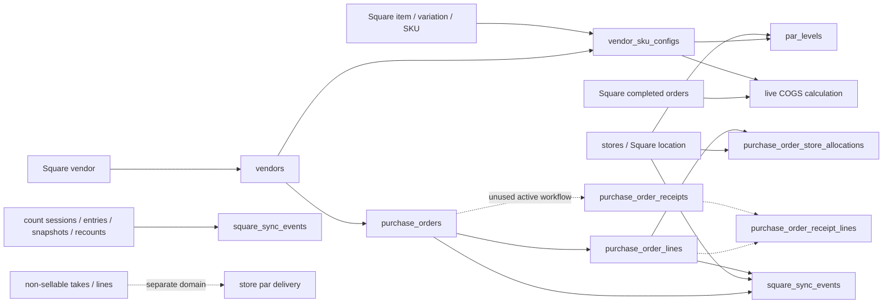

# Current Ordering domain data map

Status: confirmed schema/code behavior unless labeled inferred. V1 owns operational writes.

## Relationship map

## Entity ownership and semantics

| Requested concept | Current representation | Authority / mutability | Findings |
|---|---|---|---|
| Store | `stores` with `square_location_id` | Local registry references Square location; mutable active/name/link | SQL uniqueness exists for Square ID; Ordering uses all active linked stores |
| Square catalog item | Live Square response; item ID not stored on PO line | Square authoritative | PO snapshots item name only; no item FK |
| Variation / SKU | Square variation ID and SKU; copied into mappings and PO lines | Square identity; local copies mutable/snapshotted | SKU is used as human/config key and can be duplicate/blank; variation ID is safer identity |
| Vendor | `vendors` cache keyed by `square_vendor_id` | Square-derived cache, sync may deactivate | Local numeric ID is FK owner |
| Vendor product/catalog | `vendor_sku_configs` | Mixed Square cache and local operating config | No separate vendor-product entity or vendor catalog version |
| Vendor SKU mapping | `vendor_sku_configs(vendor_id,sku)` | Mutable local | Holds variation, GTIN, cost, pack, MOQ, default, active together |
| Preferred vendor | `is_default_vendor`; partial unique active default per SKU | Mutable local, global across stores | No dated preference or fallback policy |
| Par / level | `par_levels` by vendor, optional store, SKU | Mutable local plus derived suggestion/confidence | “manual_par_level” is reorder level; “manual_stock_up_level” is target/par, naming differs by workflow |
| MOQ | `vendor_sku_configs.min_order_qty` | Mutable local, global vendor/SKU | Applied before pack rounding |
| Case/pack | `vendor_sku_configs.pack_size` | Mutable local | Used for ordering rounding, PDF display, scan increment; Square receives individual units |
| Ordering lock/exclusion | `par_levels.locked_manual` only | Mutable but not an exclusion | No do-not-order or dated exclusion; manual zero can suppress recommendation |
| Product status | Mapping `active`; Square sellability/deletion not consistently reconciled | Ambiguous | No explicit ACTIVE/DISCONTINUED/SEASONAL/DO_NOT_REORDER model |
| Recommendation | Transient `LineMathResult` / report row | Derived, not persisted independently | Draft generation immediately converts selected calculated rows into PO state |
| Purchase order | `purchase_orders` | Mutable V1 operational record | DRAFT and IN_TRANSIT writable; status enum contains unused values |
| PO line | `purchase_order_lines` | Snapshot-like but mutable | Labels, IDs, costs, price, quantities, par/confidence copied; refresh can overwrite before submit and edits continue after |
| Store allocation | `purchase_order_store_allocations` | Mutable current state | Holds expected, allocated, manual par, received, variance; no allocation event history |
| Receipt / receipt line | `purchase_order_receipts`, `purchase_order_receipt_lines` | Schema only; active service does not use | Production row count unknown; cannot assume unused operationally |
| Inventory adjustment | `square_sync_events` request/response plus Square remote state | Attempt ledger, not generalized domain entity | PO receive, emergency, counts share table with different sync types |
| Vendor payment | Four fields on `purchase_orders` | Mutable overwrite | Only PAID/UNPAID; no method/account/event/partial/combined payment |
| COGS record | None | Computed live | Completed Square sales × current mapping cost; not tied to PO receipt or payment |
| Non-sellable quantity | `non_sellable_stock_take_lines` snapshots and separate par tables | Local operational facts | Not SKU-based; not included in sellable ordering inventory |
| Count result | `count_sessions`, `snapshot_lines`, `entries` | Local snapshot and submitted facts | Can drive Square physical-count writers, but no direct recommendation input |
| Recount result | recount state/items plus session snapshots | Mutable state + history | Automatic closeout may push Square; no direct PO link |

## Duplicate and ambiguous representations

- Identity: SKU, variation ID, GTIN, and synthetic `SKU::...` keys coexist; item ID is absent from PO lines.
- Cost: Square vendor cost, mutable mapping unit cost, mutable PO line cost, and current-cost COGS lookup can differ.
- Quantity: Square on-hand, PO expected/allocated/ordered/in-transit/received, count expected/counted/variance, and non-sellable quantities are separate meanings.
- Par terminology: UI “level” maps to `manual_par_level`; UI “par/stock-up” maps to `manual_stock_up_level`; PO line exposes only one manual par field.
- Receiving: allocation `store_received_qty` is active truth while receipt tables are dormant.
- Payment: invoice amount is re-derived from current active line cost/ordered quantity while paid amount is stored.
- Status: mapping `active`, Square catalog activity/sellability, and any business discontinuation intent are not one concept.

## Constraint and ownership gaps

- No FK from SKU text to a durable product identity; mappings and pars join by text.
- `par_levels` has no ORM-declared uniqueness shown for vendor/store/SKU; deployed constraints must be verified before V2 reuse.
- No recommendation run/version/input snapshot or decision record.
- No row version on mappings, pars, POs, lines, allocations, invoices, or emergency drafts.
- No vendor lead time, order cycle calendar, safety stock, maximum stock, exclusion, reason, or effective dates.
- No payment, account, accounting period, COGS allocation, transfer, shipment, damage, shortage, or backorder entities.
- `square_sync_events` references PO/line/store but emergency/count events may have no PO identity.

## Safe read/reuse conclusion

Proposed V2 read-only intelligence may read stores, vendors, mappings, pars, open V1 PO allocations, and captured Square read snapshots through an adapter. It must treat them as V1-owned inputs and must not normalize or update them. New recommendation evidence and decisions need V2-owned tables. V2 drafts must use distinct V2 identities/tables until a writer cutover prevents V1/V2 collision.
