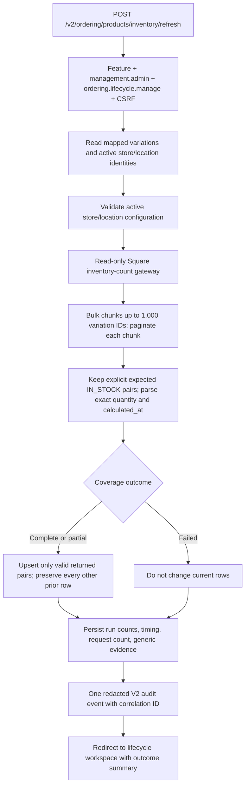

# Ordering current-inventory read-model design

Status date: 2026-07-25. Status: **ORD-DEC-037 APPROVED — FOCUSED RUNTIME IMPLEMENTATION AUTHORIZED; DEPLOYMENT NOT AUTHORIZED**.

This design provides current, store-isolated inventory to Product Lifecycle, Archived Products, and a future Stagnant Inventory module. It does not authorize implementation, deployment, production migration, a production refresh, scheduled work, staff exposure, or lifecycle automation.

## Source analysis

| Source | Finding | Disposition |
|---|---|---|
| `vendor_sku_configs` joined to active `vendors` | Existing Ordering/V1-owned authority for the deduplicated active/default mapped Square variation population | Use to define expected variations |
| Active `stores` and `stores.square_location_id` | Existing local store/location mapping | Use to define expected stores; a missing or duplicate Square location is a blocking configuration gap, never a zero |
| `SquareOrderingReadGateway._inventory_counts` | Already performs chunked and paginated inventory reads, but expands an absent Square pair into assumed zero later in the recommendation path | Do not reuse the assumed-zero behavior; add a raw count-only operation that returns only explicitly observed pairs |
| `square_ordering_data_service.fetch_on_hand_by_store_variation` | Performs live Square reads and also fills absent pairs with zero | Not a valid local lifecycle source |
| V1 count/session snapshots | Historical expected/count evidence tied to count workflows | Not current inventory |
| `ordering_catalog_identity` | Ordering-owned catalog display metadata only | No inventory facts |
| Customer Touchscreen cache and refresh tables | Separately owned and explicitly outside the Ordering contract | Never read, write, trigger, or use as fallback |

The supported Square operation is the current bulk inventory-count endpoint, `POST /v2/inventory/counts/batch-retrieve`. It accepts up to 1,000 catalog object IDs, accepts location filters, and paginates returned counts. Square documents returned records as current calculated counts but does not establish that the response is a complete Cartesian product of every requested variation and location. Therefore only an explicit returned `IN_STOCK` pair is covered; an absent pair is missing, not zero. The existing deprecated path is not changed for V1 or Phase 1 recommendations by this milestone.

Reference: [Square Batch Retrieve Inventory Counts](https://developer.squareup.com/reference/square/inventory-api/batch-retrieve-inventory-counts).

## Implemented persistence model

One additive migration after `20260725_0008` creates two Ordering-owned tables. There is no backfill, and pre-migration code safely ignores both tables.

### `ordering_inventory_refresh_runs`

One immutable outcome row per explicit refresh attempt:

| Column | Contract |
|---|---|
| `id` | Big integer primary key |
| `correlation_id` | Unique 36-character UUID text, safe to show in support output and audit records |
| `result` | Checked `COMPLETE`, `PARTIAL`, or `FAILED` |
| `expected_variation_count` | Deduplicated mapped variation count |
| `active_store_count` | Active-store count, including a store with missing configuration |
| `expected_pair_count` | Expected variation × active-store pair count |
| `covered_pair_count` | Distinct expected pairs explicitly returned with a parseable quantity |
| `missing_pair_count` | Expected minus covered; never inferred from quantity |
| `square_request_count` | Every inventory-count page request, including a failed final request |
| `started_at` / `completed_at` | UTC refresh timing |
| `error_code` / `error_summary` | Generic, sanitized failure evidence; no token, payload, customer, or payment data |
| `refreshed_by_principal_id` | Owner principal foreign key |
| `created_at` / `updated_at` | UTC persistence timestamps |

Count checks require all counts to be non-negative and `covered_pair_count + missing_pair_count = expected_pair_count`. A `COMPLETE` run requires zero missing pairs; `PARTIAL` requires at least one covered and one missing pair; `FAILED` writes no current rows.

### `ordering_current_inventory`

One last-valid row per store and mapped variation:

| Column | Contract |
|---|---|
| `square_variation_id` | Text key component; intentionally not dependent on catalog-identity coverage |
| `store_id` | Active/inactive historical store foreign key and key component |
| `square_location_id` | Location identity used for this observation |
| `counted_quantity` | Exact Square quantity as `NUMERIC(14,3)`; negative source values remain visible rather than being silently clamped |
| `source_calculated_at` | Square `calculated_at` when supplied |
| `refreshed_at` | Time the successful response was obtained |
| `freshness_state` | Write-time policy label; GET projections recompute effective `FRESH` (0–24h), `STALE` (>24–72h), or `CRITICAL` (>72h) from `refreshed_at` |
| `refresh_run_id` | Foreign key to the run that last supplied this pair |
| `created_at` / `updated_at` | UTC persistence timestamps |

The composite primary key is `(square_variation_id, store_id)`. Indexes support lookup by variation and refresh run. Rows are retained when a store becomes inactive, a mapping changes, or a later refresh is partial/failed; workspace queries join only the current active-store/mapping population.

`refreshed_at`, not Square `calculated_at`, is the recommended freshness clock. Square describes `calculated_at` as the timestamp of the most recent inventory calculation/change, so a live retrieval can legitimately return an old source timestamp for unchanged inventory. The source timestamp remains retained and displayed as evidence. The stored freshness state records the evaluation made when the row was persisted; GET projections recompute the effective state from the approved policy and timestamps without writing during rendering.

## Explicit refresh flow

The route reuses the existing owner-only `ordering_intelligence_v2` exposure and `ordering.lifecycle.manage` capability because the refresh exists solely to support owner lifecycle decisions. A new capability would add rollout/configuration work without creating a meaningful separation in the currently authorized scope.

The gateway exposes a new count-only result rather than calling the recommendation `fetch` method. It uses only the canonical read endpoint, never calls Square inside a product loop, never uses a Square write endpoint, and retains request/page timing metrics. No scheduled worker is introduced.

Concurrent submissions use a PostgreSQL advisory transaction lock and return a non-destructive “refresh already in progress” result when the lock is unavailable. This avoids overlapping snapshots without adding a worker or durable job system.

## Failure and preservation semantics

- A complete run upserts all expected pairs and records zero missing pairs.
- A partial run upserts only explicit valid pairs. Missing, malformed, unexpected-location, and unexpected-variation records do not overwrite last-valid rows.
- A failed request updates no current-inventory row.
- An active store without a Square location remains in the expected-pair denominator; its pairs are missing and the run can be partial when other stores are covered.
- Two active stores sharing one Square location make store attribution ambiguous, so the complete refresh fails before applying any current row.
- A later active-store location change makes the old location row ineligible until the new pair is refreshed.
- An absent Square result never creates a quantity-zero row.
- An explicit Square quantity of `0` is valid only for that returned store/variation pair.
- Audit and run evidence contain counts, timing, generic error type, correlation ID, and actor only—not credentials or Square payloads.

## Workspace integration

The current lifecycle catalog repository uses six bounded queries. Inventory integration adds three bounded queries:

1. active stores and current Square location IDs;
2. latest terminal inventory refresh run;
3. all current-inventory rows for the page population and active stores.

The resulting repository budget is nine queries regardless of product count. Product Lifecycle and Archived Products GET routes remain database-only, make zero Square calls, make zero Touchscreen reads, perform no recommendation calculation, and perform no writes.

For each variation:

- before the first refresh, display `Inventory unavailable`;
- require one eligible pair for every current active store before producing a company total;
- sum store quantities only after pair-level store/location identity, latest-run coverage, and freshness validation;
- display a whole-number total as an integer; preserve and display fractional source quantities without rounding if Square returns them;
- show every active store in the disclosure, with quantity, effective freshness, Square source time when available, and refresh time;
- display `Unknown` for an incomplete, failed, critically old, or store-location-mismatched aggregate;
- retain known last-valid per-store values as labeled evidence when policy permits display, but never use them to manufacture a total;
- include mapped Archived products; an unmapped historical lifecycle row remains unavailable;
- never change lifecycle state automatically.

The implementation provides `Any`, `Positive`, `Zero`, `Unknown`, and `Stale` inventory filters. Zero/positive classification applies only to a complete Fresh aggregate. Numeric minimum/maximum filters remain deferred.

## Freshness owner decision — approved

The owner approved `ORD-DEC-037` as recommended on 2026-07-25.

| Question | Recommended default | Consequence |
|---|---|---|
| When is inventory fresh, stale, or critical? | `FRESH` from 0–24 hours after successful retrieval; `STALE` over 24 through 72 hours; `CRITICAL` over 72 hours | Aligns terminology with approved recommendation freshness while remaining a separate decision |
| Is stale inventory displayed? | Yes. Display last-known total and store values with a prominent `STALE` label and as-of time | Preserves context without presenting it as current |
| May stale inventory drive sorting/filtering? | No. Only complete fresh aggregates participate in numeric sorting and Positive/Zero filters; stale values group after fresh values and classify as Unknown for operational filters | Prevents an owner action queue from implying stale data is decision-safe |
| Does one missing/failed active store make the company total Unknown? | Yes. Show available store details, but do not sum a partial company total | Preserves store isolation and prevents undercounting |
| Which timestamp drives age? | Successful `refreshed_at`; retain Square `calculated_at` separately as source evidence | Avoids treating unchanged inventory as unread merely because its last Square calculation is old |

These rules are the implementation baseline. They do not authorize deployment, production migration, production refresh, or broader exposure.

## Migration and rollback impact

- Implemented revision: additive `20260725_0009`, immediately after `20260725_0008`.
- No backfill is performed and no row implies current inventory before an explicit refresh.
- No existing table, V1 behavior, lifecycle row, catalog identity, feature exposure, or permission is modified.
- Application rollback returns to code that ignores the new tables.
- Operational rollback retains populated refresh/current rows for evidence and later recovery.
- Downgrade exists only for disposable migration verification and must not drop populated production data during normal rollback.

## Risks

| Risk | Control |
|---|---|
| Square omits a legitimate zero pair | Treat omission as missing; only an explicit `0` can prove zero |
| Partial response understates company stock | Require all active stores for a known total |
| Store/location mapping changes | Persist location snapshot and require it to match the current active-store mapping |
| Duplicate Square location assigned to stores | Fail affected coverage and surface configuration evidence |
| Old last-valid rows appear current after failure | Latest-run and effective-freshness checks prevent operational totals |
| Existing gateway assumed-zero behavior leaks in | Implement and test a separate raw count-only gateway result |
| Synchronous refresh is slow | Bulk up to 1,000 IDs, paginate, measure request count/duration, prevent overlapping refreshes |
| TD-026 transport limits remain | Owner-only explicit refresh only; no broad exposure or scheduler until separately reviewed |
| Fractional or negative Square quantity is hidden | Persist exact numeric source value and do not clamp or round silently |

## Readiness classification

**IMPLEMENTED AND LOCALLY VERIFIED — DEPLOYMENT NOT AUTHORIZED**
