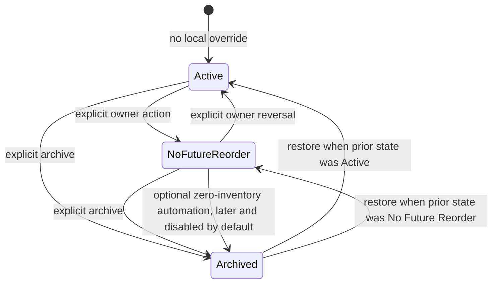
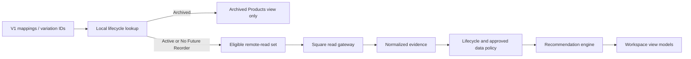

# Inventory lifecycle, Ordering Intelligence workspace, and stagnant inventory design

Status date: 2026-07-25. Status: **PHASE 1/2 IMPLEMENTED LOCALLY — BROADER DESIGN DEFERRED**. The owner approved all 15 policy choices and separately authorized only the focused Lifecycle Foundation and Ordering Integration implementation. Workspace redesign, Stagnant Inventory, automation, exposure, deployment, V1 changes, and Square writes remain unimplemented and unauthorized.

## Outcome and boundaries

The approved design introduces a local, reversible product-lifecycle decision that is separate from Square catalog state, V1 mapping activity, pars, manual locks, and recommendation policy. It also defines an operational Ordering Intelligence workspace and a future Stagnant Inventory report.

The first implementation must remain local-only: no Square product deletion, archive, inventory write, purchase-order creation, V1-table mutation, or automatic status transition. Archived history is retained. Optional automatic archive remains disabled and belongs to a separately approved later phase.

## Functional specification

### Identity and scope

The lifecycle key is the Square **variation ID**, not SKU text. SKU and product name are mutable display snapshots and cannot safely identify a durable decision. Lifecycle is one global state per variation. Store-, vendor-, and date-scoped purchasing exclusions remain separate merchandising decisions governed by `ORD-DEC-004` and `ORD-DEC-005`; they must not be represented as lifecycle states.

A Square item with several variations therefore has several independently controlled lifecycle records. Item-level cascading is not proposed for the first version.

### State meanings

| State | Operational meaning | Ordering Intelligence | Inventory and sales | Reports |
|---|---|---|---|---|
| `ACTIVE` | The variation participates in normal operations. | Calculate under the approved recommendation policies. | Continue normal retrieval and display. | Included in standard reports. |
| `NO_FUTURE_REORDER` | Sell existing inventory, but intentionally never purchase this variation again. | Keep the product visible and calculate descriptive metrics, but do not generate or display a purchase quantity. Show `NO FUTURE REORDER` and a named blocking reason. | Continue inventory, sales, last-sale, and velocity tracking. | Include in Stagnant Inventory when store inventory is greater than zero. |
| `ARCHIVED` | Administrative removal from active operations. | Exclude before expensive recommendation work. Do not create a recommendation row. | Exclude from eligible variation-scoped count and inventory-change reads. Preserve prior local facts and action history; current catalog and location/date order-search behavior is unchanged until separately approved. | Exclude from default reports; show in the Archived Products management view. |

Absence of a local lifecycle row means `ACTIVE`. This sparse-override model avoids a speculative backfill and ensures newly discovered Square variations are visible by default. It also permits a rollback to ignore the lifecycle table without altering V1.

Square `is_deleted`/discontinued evidence remains external product-status evidence. It can suppress an actionable recommendation under approved `ORD-DEC-014`, but it does not silently create or change a local lifecycle record. Likewise, `vendor_sku_configs.active`, par zero, null par, and `locked_manual` do not imply a lifecycle state.

### State transitions



Archiving retains `pre_archive_status`. Restore returns a trusted prior `ACTIVE` state to `ACTIVE` and a trusted prior `NO_FUTURE_REORDER` state to `NO_FUTURE_REORDER`. An unavailable, invalid, or untrusted prior state restores visibly to `NO_FUTURE_REORDER` and requires a separate explicit owner action before purchasing resumes. Every transition is explicit, version-checked, audited, and reversible. There is no delete transition.

### Bulk archive and restore

The product-management view supports:

- one checkbox per visible variation;
- `Select all visible`, explicitly limited to the current rendered page;
- `Archive selected` and `Restore selected`;
- one confirmation dialog stating the selected count and lifecycle effect;
- one atomic server command per batch, with no per-row confirmation;
- an atomic maximum of 250 variations and a conflict result if any selected lifecycle row changed after display.

Archive captures Square variation ID, current SKU and product-name snapshots, actor, UTC time, optional note, and prior state. Restore captures actor and UTC time and retains the archive evidence. Missing live Square metadata uses the stored snapshots so an archived deleted variation remains recoverable.

The first version rejects a mixed or stale batch atomically rather than partially changing an unknown subset. Oversized requests are rejected server-side. A later version may provide explicit per-row outcomes if operational evidence shows that is preferable.

### Ordering Intelligence behavior

The coordinator should resolve lifecycle decisions immediately after loading local product mappings and before constructing the variation set sent to inventory-count and inventory-change reads:



`NO_FUTURE_REORDER` must not be implemented by setting par to zero or by calculating a quantity and hiding it in the template. The policy layer produces an explicit non-purchasable outcome before purchase-quantity calculation and does not calculate or retain a hypothetical quantity, while preserving inventory, sales, velocity, last-sale evidence, freshness, confidence, warnings, and explanation metadata. Confidence remains informational and must not override lifecycle policy.

`ARCHIVED` filtering must occur in the coordinator/repository boundary, not the route, recommendation engine, or template. Direct calls to the engine remain independently testable.

### Stagnant Inventory report

Eligibility is evaluated per store and variation:

```text
lifecycle == NO_FUTURE_REORDER
AND current inventory > 0
AND required inventory evidence is available
```

Unavailable or critically stale inventory must not be interpreted as zero. Such products remain visible in an `Unable to determine` report state, separate from the eligible total, until fresh evidence is available.

| Column | Proposed definition/source |
|---|---|
| Product / SKU | Live Square catalog metadata, with lifecycle snapshot fallback |
| Store | Server-authorized local store mapped to Square location |
| Vendor | Current active preferred local vendor mapping; label missing/ambiguous mappings |
| Category | Square category read model; current Ordering gateway does not yet provide this field |
| Current inventory | Store-isolated fresh Square count; never pooled |
| Inventory value | `current inventory × unit cost`, using preferred-vendor valid configured cost, then trustworthy most recent valid purchase cost, then `Unknown`; display basis and as-of time |
| Last sale date | Latest observed positive sale for that store/variation from a durable read model |
| Days since last sale | Report as-of date minus last sale date; `No observed sale` is distinct from zero |
| Velocity | Approved deterministic window and stockout adjustment, labeled with window/as-of time |
| Estimated sell-through | Inventory divided by positive adjusted daily velocity; zero velocity displays `No projected sell-through`, not a fabricated day count |
| Shelf location | Outside Ordering ownership; a future Inventory Management model may later provide it |
| Notes | Future report notes require a separate ownership/editing decision; lifecycle note is not a shelf-location field |

Every column is sortable through a server-side allowlist with a stable variation/store tie-breaker. Summary metrics use the same filtered dataset and valuation basis as the rows:

- total stagnant products;
- total units remaining;
- known inventory value plus an explicit count of rows with unknown cost;
- average days since last sale over rows with a known last sale;
- oldest known last-sale product;
- counts older than 90, 180, and 365 days.

The current request-time Square sales window is 56 days and cannot truthfully supply 90/180/365-day last-sale metrics. Stagnant Inventory therefore depends on an approved durable Square read/snapshot foundation; it must not trigger an unbounded order-history scan during a page request.

## UI/UX proposal

### Information architecture

Use one Ordering Intelligence module with four destinations:

1. **Actionable** — active products with actionable calculated need greater than zero; sort by need descending, then stable product/variation.
2. **Review Required** — active products with critical/blocked, stale/informational, low-confidence, or remaining named review reasons in that precedence, using stable ties.
3. **All Active** — all non-archived products, including `NO_FUTURE_REORDER`; sort by product name, then stable variation.
4. **Archived Products** — separate recoverable management view; not mixed into the default recommendation queue.

Stagnant Inventory is a separate report destination focused on `NO_FUTURE_REORDER` inventory greater than zero. Archived filtering in the workspace should navigate to the Archived Products view rather than silently adding archived rows to the operational recommendation table.

### Sorting and filtering

All user selections use GET query parameters so filtered views are linkable and refresh-safe. Filters combine with `AND`; multiple selected values within one dimension combine with `OR`. Unknown/null values have explicit choices rather than disappearing.

The workspace supports the requested sort fields: product, SKU, store, vendor, category, data status, confidence, sellable inventory, incoming, velocity, calculated need, last sale, days since last sale, and last refresh.

It supports simultaneous filters for store, vendor, category, product/SKU search, data status, confidence, actionability, positive need, new product, zero sales, manual lock, zero par, null par, incoming inventory, `NO_FUTURE_REORDER`, and lifecycle view. Search is normalized and bounded; sort keys and directions are allowlisted.

The active filter summary is always visible, includes individual remove controls and `Clear all`, and distinguishes zero, null, unavailable, and false. The page announces result count and scope after filtering.

### Table and detail behavior

Use server-side pagination with choices 25, 50, 100, and 250, defaulting to 50; unlimited pages are prohibited. The table shows operational columns only; explanation data moves to an on-demand detail panel or detail route instead of rendering every collapsed explanation into the initial HTML response. Keyboard selection, an indeterminate header checkbox, visible focus, accessible labels, and a selection count are required.

Every lifecycle-controlled product display includes plain accessible status text—`ACTIVE`, `NO FUTURE REORDER`, or `ARCHIVED`—and never relies on color alone. Archived status appears in the Archived Products view and lifecycle detail/history, not normal Ordering rows.

Pagination alone does not reduce current Square retrieval, because several sorts and filters require the complete calculated result set. It becomes a performance control only when paired with an approved cached/snapshotted read model or when lifecycle filtering safely narrows the Square inputs before retrieval.

## Database impact

One additive local table is the minimum proposed schema:

### `ordering_product_lifecycle`

| Column | Rule |
|---|---|
| `square_variation_id` | Text primary key; immutable lifecycle identity |
| `status` | Checked value: `ACTIVE`, `NO_FUTURE_REORDER`, `ARCHIVED` |
| `pre_archive_status` | Nullable checked value: `ACTIVE` or `NO_FUTURE_REORDER` |
| `sku_snapshot` | Nullable text captured at the latest lifecycle action |
| `product_name_snapshot` | Nullable text captured at the latest lifecycle action |
| `status_note` | Nullable bounded text; optional owner note |
| `no_future_reorder_at/by` | Nullable UTC timestamp and principal FK |
| `archived_at/by` | Nullable UTC timestamp and principal FK |
| `restored_at/by` | Nullable UTC timestamp and principal FK |
| `row_version` | Positive integer for optimistic concurrency |
| `created_at`, `updated_at` | UTC timestamps |

Constraints should require archive actor/time for `ARCHIVED`, prohibit `ARCHIVED` as `pre_archive_status`, and preserve null/zero distinctions. Index `status`; add no SKU uniqueness because SKU is not durable identity.

Each successful product transition writes the existing versioned V2 audit envelope in the same PostgreSQL transaction. A bulk command creates one audit event per changed variation with a shared redacted correlation/batch identifier. Audit metadata records from/to states and the optional note but no Square payload.

A later read-operations milestone may add immutable refresh/snapshot tables for catalog metadata, store inventory, daily sales, inventory deltas, and latest-sale evidence. Those tables are not part of the lifecycle migration and require a separate TD-026 design and retention decision.

## Approved business-rule additions

These identifiers are approved for implementation planning in the authoritative register. Approval does not authorize implementation.

| Decision ID | Rule | Approved behavior | Approval state |
|---|---|---|---|
| `ORD-DEC-028` | Lifecycle identity and scope | Global Square variation ID | APPROVED |
| `ORD-DEC-029` | No Future Reorder recommendation behavior | Preserve descriptive evidence; calculate no purchase quantity | APPROVED |
| `ORD-DEC-030` | Archive and restore semantics | Restore trusted prior state; fallback visibly to No Future Reorder; atomic bulk | APPROVED |
| `ORD-DEC-031` | Archived remote-read behavior | Exclude from eligible variation-scoped count/history reads; do not overstate catalog/order filtering | APPROVED |
| `ORD-DEC-032` | Stagnant inventory eligibility | Store-isolated No Future Reorder plus fresh inventory above zero; shelf location outside Ordering | APPROVED WITH MODIFICATION |
| `ORD-DEC-033` | Inventory valuation | Preferred configured cost, then trustworthy recent purchase cost, then Unknown | APPROVED WITH MODIFICATION |
| `ORD-DEC-034` | Last-sale evidence and no-sale display | Durable latest positive store sale; No observed sale differs from Unknown | APPROVED |
| `ORD-DEC-035` | Default workspace queues | Approved queue precedence, page choices, and 250-row maximum | APPROVED WITH MODIFICATION |
| `ORD-DEC-036` | Automatic zero-inventory archive | Disabled and excluded; later approval required | APPROVED |

These rules do not replace dated exclusions, vendor fallback, MOQ/case-pack, transfer, purchasing, or other deferred decisions.

## Ordering-policy interactions

Policy precedence should be explicit:

1. Resolve variation identity and local lifecycle.
2. Exclude `ARCHIVED` before routine remote reads and recommendation candidates.
3. For non-archived products, assess required-source freshness and completeness normally.
4. For `NO_FUTURE_REORDER`, retain evidence and descriptive calculations but set purchase actionability to excluded/blocked and leave purchase quantity absent.
5. For `ACTIVE`, apply approved Phase 1 policies without change.
6. Confirmed Square discontinued/deleted status remains an independent blocking reason.

If a product is both `NO_FUTURE_REORDER` and Square-discontinued, display both reasons. Lifecycle must never raise confidence or make stale data actionable. Manual lock, zero par, null par, incoming supply, and stockout adjustment retain their approved meanings.

## Performance implications

The 2026-07-25 diagnostic measured 39 Square requests/24.795 seconds for one store and 122 requests/95.910 seconds for all stores. Inventory-change history accounted for 19.555 and 82.227 seconds respectively. Database access was a fixed 12 queries and under 0.04 seconds.

An archive filter can materially reduce:

- variation IDs sent to batch inventory counts;
- variation IDs sent to batch inventory changes, the current dominant cost;
- per-store/variation normalization and calculation work;
- response size and browser DOM rows.

It does **not** by itself reduce:

- the current full Square catalog scan, which filters desired variations locally;
- the location/date-based orders search, which currently retrieves orders then filters line variations locally;
- repeated retrieval of the same rolling history on later requests.

Therefore archive filtering is a valid first-stage optimization but not a substitute for TD-026. Before implementation, profile how many of the 824 currently mapped variations would actually be archived or marked no-future-reorder and estimate expected chunk/page reduction. Do not claim a latency target from archive count alone because Square pagination depends on matching change volume, not only variation count.

The Stagnant Inventory report and broad workspace should consume one approved read model rather than independently calling Square and doubling remote work. Lifecycle lookup must be one batched local query, never one query per product.

## Migration and rollout strategy

1. Owner decisions and data ownership contract approved on 2026-07-25.
2. Add one forward-only additive migration after then-current head `20260720_0006`; create lifecycle constraints/indexes and no data backfill. Implemented as `20260725_0007`.
3. Add model/repository/service code behind existing disabled-by-default Ordering exposure plus a separate mutation capability. Do not expose routes yet.
4. Verify empty/current-head upgrade, representative PostgreSQL upgrade, constraints, concurrency, and downgrade in disposable databases.
5. Deploy dark, then expose lifecycle management to the owner principal only. Existing recommendations remain unchanged until a separately reviewed integration checkpoint.
6. Integrate batched archive filtering and `NO_FUTURE_REORDER` policy outcomes; compare active-product Phase 1 results byte-for-byte against the prior engine.
7. Complete the TD-026 read-operations foundation before broad workspace or Stagnant Inventory rollout.
8. Canary workspace/report destinations read-only first; retain V1 and current Ordering bridge unchanged.

If code rollback is required after lifecycle rows exist, disable exposure and make the previous code ignore the additive table; retain lifecycle and audit records. Do not drop a populated lifecycle table during operational rollback. Schema downgrade is appropriate only in disposable verification or before any production lifecycle action.

## Estimated implementation phases

Estimates are engineering working days, excluding owner review, canary observation, and deployment windows.

| Phase | Scope | Estimate | Gate |
|---|---|---:|---|
| 0. Decisions and production profile | Rules resolved; remaining work is count/profile and source validation | 1–2 days | Policy gate complete |
| 1. Lifecycle foundation | Additive migration, model, repository, transition service, capability, audit, bulk archive/restore management UI | 4–7 days | PostgreSQL and security review |
| 2. Ordering integration | Batched lifecycle filter, No Future Reorder policy outcome, explanation/view-model changes, V1/Phase 1 parity tests | 3–5 days | No unexplained active-product difference |
| 3. Read operations foundation | TD-026 observability, bounded refresh/snapshot design, freshness/failure contract, latest-sale evidence | 7–12 days | Separate architecture approval |
| 4. Ordering workspace UX | Queues, server sorting/filtering/search, pagination, on-demand explanations | 5–8 days | Owner usability review |
| 5. Stagnant Inventory | Report rows, valuation/last-sale rules, metrics, sorting/filtering, exports only if separately approved | 5–8 days | Data reconciliation and owner canary |
| 6. Optional automation | Configurable zero-inventory auto-archive, disabled by default, dry-run/monitoring/runbook | 3–6 days | Separate explicit approval; later phase |

Phases 1 and 2 may be delivered independently of the read snapshot, but Phases 4–5 should not broaden exposure while synchronous Square performance remains unresolved.

## Planned implementation surface

No files in this list are authorized for modification yet.

- Models/migration: `app/models.py`, a new Alembic revision after `20260720_0006`.
- Lifecycle repository/service: new focused Ordering lifecycle modules; no lifecycle logic in routes/templates.
- Coordinator/policy: `v2_ordering_data_coordinator.py`, normalization/policy/result contracts as approved; recommendation math remains independent.
- Square/read model: `v2_ordering_square_gateway.py` only after the separate performance design is approved.
- Routes: proposed GET archived/stagnant destinations and CSRF-protected batch archive/restore POST commands.
- Templates/view models: workspace queues, archived management, stagnant report, deferred explanation detail.
- Authorization/audit: approved dedicated `ordering.lifecycle.manage` capability and existing V2 audit envelope; initial exposure remains owner-only.
- Tests: pure transition/policy tests, PostgreSQL constraints/concurrency/migrations, route capability/scope/CSRF tests, captured Square fixtures, Phase 1 parity, V1 regression, and response-size/query-count performance guards.

## Risks

| Risk | Impact | Mitigation/gate |
|---|---|---|
| SKU or item-level identity is used instead of variation ID | Wrong products change lifecycle | Variation-ID primary key; snapshot names are display only |
| Restore silently re-enables purchasing | Accidental reorder | Preserve and restore `pre_archive_status` |
| Lifecycle is inferred from par, lock, mapping active, or Square deletion | Conflated business meanings | Explicit local state and independent reason codes |
| Archived filtering hides failed Square reads as zero | False archive/stagnant totals | Unknown/critical evidence remains explicit; never auto-transition |
| Bulk action partially succeeds | Operator cannot know final scope | Initial atomic batch plus version conflict |
| Archive filter is presented as a complete performance solution | Broad rollout remains slow | Retain TD-026 gate and measure actual page reduction |
| Last-sale search scans unbounded Square history on request | Severe latency/rate-limit risk | Durable latest-sale read model prerequisite |
| Inventory value silently treats missing cost as zero | Understated financial exposure | Display unknown cost and valuation coverage |
| All explanation rows remain in initial HTML | Large response/DOM | Paginated table and on-demand details |
| Automatic archive races stale inventory | Active product disappears incorrectly | Later phase, disabled default, fresh all-store evidence, dry-run and audit |
| Lifecycle controls alter V1 | Coexistence violation | New V2-owned table only; V1 regression and no V1 write |

## Owner decision status

All 15 owner decisions are resolved: 12 approved and three approved with modification. No lifecycle owner-policy decision remains open. See the [decision packet](./inventory-lifecycle-owner-decision-packet.md), [blocker matrix](./inventory-lifecycle-blocker-matrix.md), and focused [Phase 1/2 implementation plan](./inventory-lifecycle-phase-1-2-implementation-plan.md).

Stagnant Inventory remains technically blocked by the durable Square last-sale/read-model dependency and trustworthy most-recent-purchase-cost evidence. Automatic archive remains disabled and outside the first implementation. Shelf location belongs to future Inventory Management.
