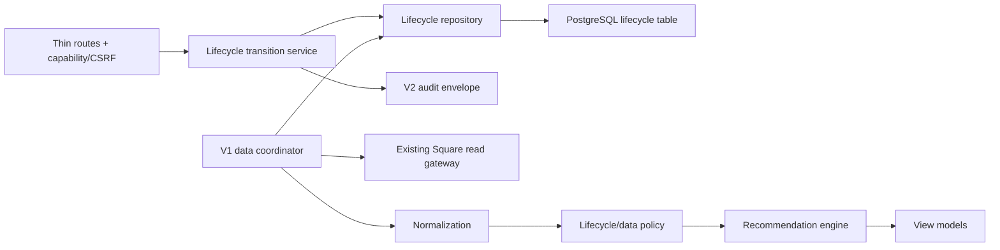

# Inventory lifecycle Phase 1/2 implementation plan

Status date: 2026-07-25. Status: **IMPLEMENTED AND POSTGRESQL-VERIFIED — OWNER CANARY APPROVAL PENDING**. Owner authorized the Phase 1/2 runtime scope in this plan. The implementation remains undeployed and unexposed; post-classification performance measurement belongs to the later owner canary after real products are archived.

## Scope and acceptance boundary

This plan covers only:

- **Phase 1 — Lifecycle foundation:** additive lifecycle storage, transitions, owner-controlled bulk management, archived recovery, capability, audit, tests, and rollback.
- **Phase 2 — Ordering integration:** one batched lifecycle lookup, archived filtering ahead of eligible variation-scoped Square reads, explicit No Future Reorder no-quantity outcomes, lifecycle presentation, active-product parity, diagnostics, and remeasurement.

It excludes durable Square snapshots, long-horizon last-sale ingestion, Stagnant Inventory, automatic archive, clearance, transfers, promotions, vendor returns, shelf location, Square writes, V1 mutation, and staff/global exposure.

## Architecture

Routes validate HTTP input only. Transition rules live in the lifecycle service. SQL and locking live in the repository. Lifecycle policy is independent from templates. The existing recommendation math remains unchanged for `ACTIVE` products.

## Phase 1 — Lifecycle foundation

### Additive PostgreSQL migration

Create one new revision after then-current head `20260720_0006`. Implemented as `20260725_0007`; the migration is additive and performs no lifecycle backfill, so absence of a row means `ACTIVE`.

Proposed table `ordering_product_lifecycle`:

- `square_variation_id` text primary key;
- checked `status`: `ACTIVE`, `NO_FUTURE_REORDER`, `ARCHIVED`;
- checked nullable `pre_archive_status`: `ACTIVE` or `NO_FUTURE_REORDER`;
- nullable bounded `sku_snapshot`, `product_name_snapshot`, and `status_note`;
- nullable lifecycle actor/timestamp pairs for No Future Reorder, archive, and restore;
- positive `row_version`, starting at 1;
- UTC `created_at` and `updated_at`;
- principal foreign keys using the existing principal ownership convention;
- index on `status`.

Database checks enforce valid status/prior-state combinations and required archive evidence. Application validation supplies the richer transition contract. No SKU uniqueness, store/vendor lifecycle column, shelf-location field, Square mutation marker, or V1 foreign-key ownership is added.

Migration verification covers upgrade from current head, empty-database upgrade, representative PostgreSQL upgrade, constraint failures, downgrade in disposable databases, and schema-contract head update. Operational rollback retains populated lifecycle data; it does not downgrade/drop the table.

### Model, repository, and read contract

Add an ORM model and focused repository. Repository operations:

- batch-load lifecycle rows for variation IDs in one query;
- list non-archived/archived controls with stable pagination;
- lock the complete selected lifecycle set for transition;
- insert sparse overrides for previously implicit `ACTIVE` variations;
- compare every expected row version before any mutation;
- update the full batch atomically and increment versions;
- never query once per product.

The read contract resolves missing rows as an immutable `ACTIVE` value object without writing on GET. Stored SKU/name are fallback snapshots only; they never replace Square variation identity.

### Transition service

Support explicit commands rather than a generic unrestricted status setter:

- set `ACTIVE` to `NO_FUTURE_REORDER`;
- explicitly reverse `NO_FUTURE_REORDER` to `ACTIVE`;
- archive either active operating state while recording `pre_archive_status`;
- restore to trusted `pre_archive_status`;
- restore invalid/untrusted prior state visibly to `NO_FUTURE_REORDER`;
- reject invalid, missing-identity, unauthorized, stale-version, duplicate, and oversized selections.

Maximum batch size is 250. Any invalid member rejects the complete command and changes no row. Notes are optional and bounded. Every success writes one V2 audit event per variation in the same transaction, sharing one safe batch/correlation identifier. The service does not commit independently of its owning transaction boundary.

Stable result codes should include success, empty selection, oversized selection, duplicate variation, invalid transition, missing identity, stale version, and unauthorized scope. Safe messages must not expose Square payloads or internal SQL.

### Capability and exposure

Add `ordering.lifecycle.manage` to the permission catalog with **no role fallback**. Viewing Ordering Intelligence retains its current `management.admin` and feature requirements; mutation routes require the dedicated capability in addition to existing feature/route access.

Do not grant the new capability through code or migration. Initial owner-principal assignment is a separate deployment/exposure action requiring approval. STORE, LEAD, ordinary management, and global feature exposure remain unchanged.

### Routes and UI

Planned thin routes under the existing Ordering module:

- GET lifecycle product-management page;
- GET Archived Products page;
- POST bulk set No Future Reorder/Active;
- POST bulk archive;
- POST bulk restore.

Every POST requires CSRF, `ordering.lifecycle.manage`, typed variation/version pairs, maximum 250, and one confirmation for the complete selected set. `Select all visible` means the current page only. Page-size choices are 25, 50, 100, and 250; default 50; server rejects unsupported/unlimited values.

Use one plain-text lifecycle badge wherever lifecycle-controlled products appear: `ACTIVE`, `NO FUTURE REORDER`, or `ARCHIVED`; color is supplemental only. Archived status appears on Archived Products and lifecycle detail/history, not normal Ordering rows. Product management may reuse the existing catalog read boundary once per request for active product names and stored action snapshots as fallback; it must not duplicate catalog retrieval within the request or introduce an unbounded order-history scan.

### Phase 1 tests

- Pure transition matrix, including invalid prior-state restore fallback.
- Atomic batch success/conflict/duplicate/missing/oversized cases.
- Optional-note bounds and snapshot fallback.
- PostgreSQL checks, row locks, concurrent version conflicts, and all-or-nothing behavior.
- Capability tests proving no role fallback and denial to ungranted principals.
- Feature-disabled 404, unauthorized non-disclosing response, CSRF, and method tests.
- Audit actor, from/to state, version, batch correlation, rollback-on-audit-failure, and redaction.
- Pagination/page-size/select-visible contracts and accessible badge text.
- Full V1 regression and proof that Square/V1 are not called by mutation commands.

### Phase 1 acceptance

- No implicit lifecycle inference from inventory, inactivity, par, lock, Square deletion, or mapping status.
- Every archive is recoverable and every restore follows the approved prior-state/fallback rule.
- A stale member changes zero selected rows.
- Only a separately granted owner principal can mutate lifecycle.
- No V1 or Square write, no automatic transition, and no broadened feature exposure.

## Phase 2 — Ordering integration

### Coordinator and Square input filtering

After the coordinator loads mapped Square variation IDs, batch-load lifecycle once. Partition into:

- `ARCHIVED`: omit from recommendation candidates and eligible variation-scoped inventory-count/inventory-change inputs;
- `ACTIVE`: preserve current Square input and calculation behavior;
- `NO_FUTURE_REORDER`: preserve inventory, sales, velocity, freshness, confidence, warnings, and descriptive evidence inputs.

Do not represent the existing catalog scan or location/date order search as variation-filtered. Preserve their endpoint payload semantics unless a separately approved Square refactor exists. Instrument requested variation counts, Square endpoint/page counts, stage durations, recommendation counts, and response bytes without logging payloads or credentials.

### Policy and result contract

Add lifecycle to normalized input and result metadata. Policy precedence:

1. Archived rows never become recommendation candidates.
2. No Future Reorder produces a named purchasing exclusion before quantity calculation.
3. No hypothetical quantity is calculated, retained, hidden, exported, or rendered.
4. Descriptive data-quality and demand evidence remains visible.
5. Confirmed Square discontinued/deleted evidence remains independent and may appear alongside lifecycle reasons.
6. Active rows execute the existing approved Phase 1 calculation unchanged.

Keep lifecycle policy outside the route/template. If the current combined calculation service cannot avoid computing quantity for No Future Reorder cleanly, split descriptive demand metrics from purchase-quantity calculation without changing the Active algorithm or approved outputs.

### View models and presentation

- Add accessible lifecycle badges and named exclusion explanations.
- Keep Archived products out of normal Ordering rows.
- Ensure All Active can include No Future Reorder when the later workspace queue is implemented.
- Do not implement full queue/sort/filter/pagination redesign in this phase beyond the Phase 1 management pages.
- Preserve existing freshness, confidence, warning, blocking, and debugging metadata.

### Parity and performance verification

For every `ACTIVE` store/variation, compare prior and new normalized inputs, recommendation results, actionability, confidence, warnings, explanations, and rendered values. Any difference requires an approved rule explanation; lifecycle plumbing alone is not a justification.

Repeat the exact diagnostic baseline after archived fixtures/records exist:

| Metric | Baseline single store | Baseline all stores |
|---|---:|---:|
| Total request | 24.795 s | 95.910 s |
| Recommendations | 824 | 3,296 |
| Square requests | 39 | 122 |
| Inventory-change time/calls | 19.555 s / 16 | 82.227 s / 68 |
| DB queries/time | 12 / 0.039 s | 12 / 0.032 s |
| Response bytes | 2,640,766 | 10,468,646 |

Record active/archived variation counts and do not claim a target before observing actual Square page reduction. Assert the lifecycle lookup is one batched query and no product-level SQL or Square call appears.

### Phase 2 tests

- Active-product byte-for-byte calculation parity fixtures.
- No Future Reorder has descriptive evidence and no quantity field/value anywhere.
- Archived variations never reach normalization/recommendation and are absent from eligible count/change payloads.
- No Future Reorder remains in inventory/sales evidence retrieval.
- Catalog/order request semantics remain unchanged.
- Mixed lifecycle states, Square missing/deleted evidence, zero/null par, manual lock, fresh/stale/critical data, new/zero-sales evidence, and in-transit supply.
- Batched lifecycle query count, Square request-count instrumentation, response-size measurement, and no N+1 regression.
- Route/navigation authorization and full V1 regression.

### Phase 2 acceptance

- Active Phase 1 results have zero unexplained differences.
- Archived filtering happens before eligible expensive variation-scoped reads.
- No Future Reorder cannot produce a purchase quantity.
- Lifecycle status is visible in accessible text wherever controlled products are displayed.
- Before/after diagnostics report actual impact; TD-026 remains open for durable reads and broader performance work.

## Planned file surface

Exact names may be adjusted during implementation review, but responsibilities must remain separate.

| Area | Planned files |
|---|---|
| Migration/model | Alembic revision `20260725_0007` after `20260720_0006`; `app/models.py`; schema-contract migration metadata |
| Permissions | `app/services/access_control_service.py` and focused authorization tests |
| Repository/service | new `app/services/v2_ordering_lifecycle_repository.py`; new `app/services/v2_ordering_lifecycle_service.py` |
| Routes | `app/routers/v2_ordering.py` or a focused lifecycle router if route growth would blur boundaries |
| Ordering integration | `app/services/v2_ordering_data_coordinator.py`, normalization/policy/result/view-model services; Square gateway only for safe input partition/instrumentation, not endpoint redesign |
| Templates/assets | new lifecycle/archived management templates; minimal Ordering badge changes; scoped CSS/JS for selection and one confirmation |
| Tests | new lifecycle unit/PostgreSQL/router/audit tests; focused Ordering parity/performance tests; existing V1 and V2 suites |
| Documentation | implementation record, migration/schema record, test evidence, canary and rollback checklist after implementation approval |

## Checkpoints and rollback

1. Phase 1 checkpoint after PostgreSQL, security, audit, and V1 regression pass. No exposure or deployment.
2. Phase 2 checkpoint after active parity and repeatable performance diagnostics. No exposure or deployment.
3. Deployment/exposure requires a separate approval, owner-only capability assignment, migration verification, and canary plan.

Feature rollback hides mutation/navigation surfaces and removes the owner capability assignment while preserving lifecycle rows and audit history. Code rollback uses the prior application commit, whose code ignores the additive table. Never drop a populated lifecycle table as an operational rollback. Square and V1 require no rollback because neither is changed.

## Remaining dependencies

- **Not blocking Phase 1/2:** TD-026 durable Square snapshots, long-horizon last-sale ingestion, and trustworthy recent purchase cost.
- **Blocking Stagnant Inventory:** TD-026 durable latest-sale/coverage evidence and TD-028 most-recent-valid-purchase-cost source definition/verification.
- **Blocking automatic archive:** separate owner implementation/activation approval plus durable fresh all-store inventory, dry-run, audit, monitoring, rollback, and recovery runbook.

## Planning readiness

Phase 1 lifecycle foundation and Phase 2 Ordering integration are fully specified and owner-policy ready. They remain blocked only on explicit runtime implementation authorization.
