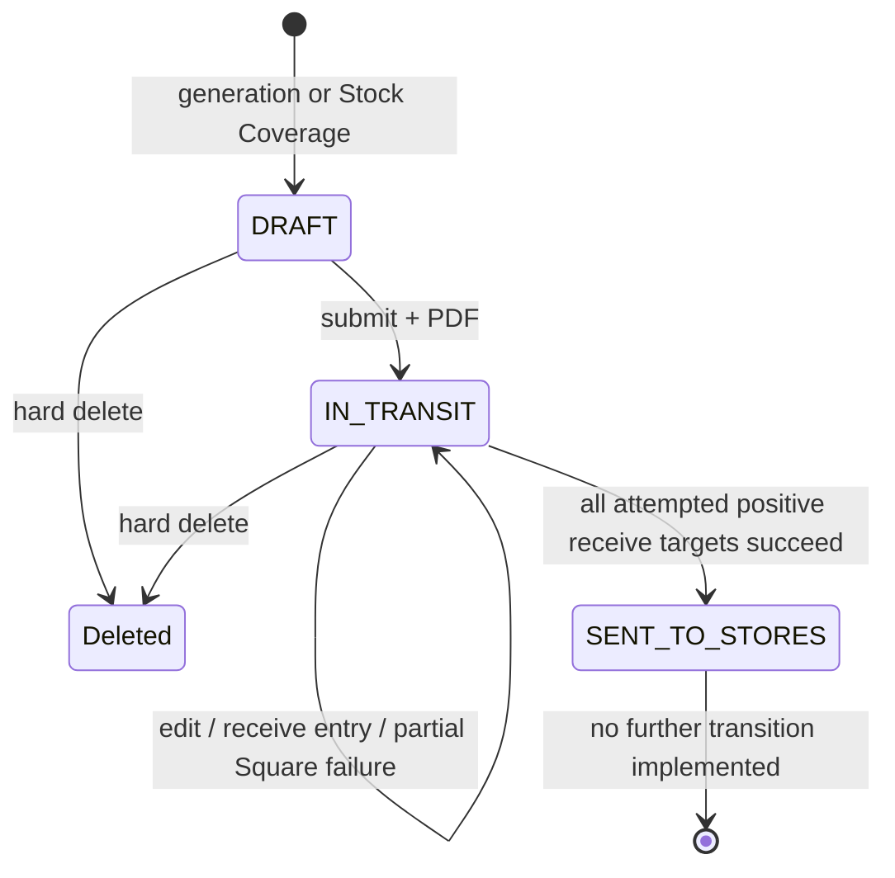
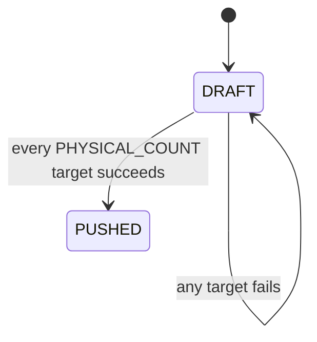

# Ordering workflow and state-machine map

This document separates confirmed V1 transitions from proposed V2 states. Schema enum presence alone is not confirmed behavior.

## Confirmed V1 purchase-order lifecycle



Confirmed active states are DRAFT, IN_TRANSIT, and SENT_TO_STORES. `RECEIVED_SPLIT_PENDING`, `COMPLETED`, and `CANCELLED` are declared but no active service transitions to them. Suggested, edited, approved, placed-with-vendor, closed, and reopened are not persisted states. “Submit” means local IN_TRANSIT and PDF generation; it does not contact the vendor.

## Confirmed V1 receiving lifecycle

```text
IN_TRANSIT PO
  -> overwrite allocation.store_received_qty manually OR increment by barcode
  -> local numeric state may be partial, exact, shortage, or overage
  -> receive action attempts each positive line/store target
       SUCCESS event -> target skipped later
       FAILED event  -> PO stays IN_TRANSIT; failed-only manual retry available
  -> all attempted targets successful -> PO SENT_TO_STORES
```

Only numeric partial receiving exists. No persisted state distinguishes damaged, missing, backordered, mis-shipped, allocated-to-store, locally reconciled, or reopened receipt. A synthetic “Unexpected Barcode” line represents an unknown scan. No receipt header/line is created despite receipt tables. The Square write is an addition of received units, not proof of physical allocation or final reconciliation.

## Confirmed V1 emergency lifecycle



After partial success the draft remains editable, and a later push generates fresh keys for every target, so successes may replay.

## Confirmed V1 vendor payment lifecycle

```text
UNPAID -> PAID(date, amount, optional/required difference note)
PAID -> UNPAID (clears all payment fields)
PAID -> PAID (overwrites fields)
```

No not-due/due/scheduled/partial/disputed/reconciled status exists. Card and wire are not represented. Payment is not a PO lifecycle transition and has no event history.

## Proposed V2 state families

These are proposed, not current facts:

- Recommendation: GENERATED -> REVIEWED -> SELECTED / IGNORED / EXCLUDED / SUPERSEDED.
- Purchase order: DRAFT -> APPROVED_SNAPSHOT -> PLACED -> PARTIALLY_RECEIVED -> FULLY_RECEIVED -> CLOSED; CANCELLED and REPLACED are explicit terminal/linked paths.
- Receipt: DRAFT -> SUBMITTED -> RECONCILED; line dispositions RECEIVED, DAMAGED, SHORT, BACKORDERED, MIS_SHIPPED, UNKNOWN.
- Inventory command: PREPARED -> APPROVED -> SENT -> SUCCEEDED / FAILED / OUTCOME_UNKNOWN -> RECONCILED.
- Payment: DRAFT -> SCHEDULED / RECORDED -> PARTIALLY_ALLOCATED / FULLY_ALLOCATED -> RECONCILED or DISPUTED.

Owner approval is required for names, transitions, reversals, locking rules, and when a PO is considered placed, received, paid, recognized in COGS, or closed.
