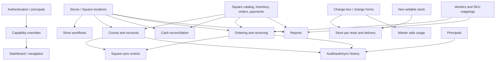

# V1 module dependency graph

## Shared foundation

## Dependency matrix

| Module | Shared tables/checks | Square/store/user/vendor/product/history dependencies | Coupling and rebuild implication |
|---|---|---|---|
| Authentication | `principals`, `web_sessions`, auth/audit tables; all five permissions | Users and optional store FK | Foundation; cannot be replaced per module without dual-session/permission strategy |
| Access controls | principals, role/principal overrides, dashboard category access | All routes consume flags | Foundation and high blast radius; preserve before any protected V2 module |
| Dashboard | dashboard category/assignment/access + permission flags | Links to nearly every management module | Can be visually rebuilt, but configuration semantics depend on final route catalog |
| Store identity | `stores.square_location_id` | Square location ID and principal store FK | Central canonical mapping; schema/identity cleanup must precede most business modules |
| Rotating counts | stores, principals, campaigns/groups, rotation, forced/recount, snapshots/entries, audit/sync | Square catalog/on-hand/write; notification stub | Very tightly coupled state machine; poor isolated first rebuild |
| Full admin count | stores/principals/admin-count/sync | Square catalog/on-hand/write | Separate implementation from rotating counts but shares sync/event semantics; consolidation decision required |
| Count groups | campaigns/groups/junction/rotation/forced counts | Square reporting categories; store credentials through shared UI | Cannot be rebuilt without count generation contract and store identity |
| Non-sellable | stores/principals/items/takes/lines | Store par uses latest submitted take | Moderate standalone workflow, but current state is later consumed by par delivery |
| Change box count | stores/count/history/current inventory | Change forms/audits/store par share current inventory | Rebuilding count alone risks inconsistent current-state ownership |
| Change forms | current change inventory + immutable forms/lines | Master-safe report and store par depend on lines/state | Tightly coupled cash movement ledger; rebuild as part of cash/change domain |
| Master safe | global inventory/par/audit + change-form facts | Principals; no Square | Rebuild with change forms to preserve denomination flow |
| Store par reset | change inventory/par, non-sellable catalog/takes/par, delivery queue, stores | Creates non-sellable take and mutates change inventory | Cross-domain transaction; defer until both source modules are stable |
| Cash reconciliation | stores, principals, actual/verification/batch | Square payment/refund/drawer/timezone | Data tables are isolated, but live expected calculation is integration-heavy; good read-only candidate before writes |
| Daily chores | stores/principals/tasks/sheets/entries | Dashboard, autosave | Mostly isolated; good early end-to-end workflow after foundation |
| Opening checklists | stores/principals/items/submissions/answers | Dashboard | Mostly isolated; default-template/version issue should be decided first |
| Customer requests | stores/principals/items/submissions/lines | Dashboard | Mostly isolated; aggregate `request_count` ownership is ambiguous |
| Exchanges/returns | stores/principals/forms | Dashboard | Isolated append-only workflow; good early module |
| Employee logs | principals/employees/categories/entries | Role and lead visibility | Isolated but permission nuance must be preserved |
| Ordering settings/mappings | vendors, SKU configs, pars, ordering settings | Square catalog/vendor/sales; stores | Foundation for every ordering/report module; data cleanup before order rebuild |
| Purchase order generation | mappings/pars/settings/stores/PO snapshot | Square catalog/orders/on-hand | Complex derived workflow; defer until mapping and report parity established |
| PO editing/PDF | PO/lines/allocations/templates, filesystem | Vendors; principals | Can be separated from generation but shares status invariants |
| Receiving | PO/lines/allocations/sync events | Square inventory writes, barcode GTIN mappings | High-risk transaction/integration state machine; late milestone |
| Emergency on-hand | vendor/config/store + draft JSON/sync events | Direct Square writes | High-risk and partially idempotent; late milestone |
| Sales/COGS | stores/vendors/mappings | Live Square orders/payments/team | Read-only but integration-heavy; calculations can be rebuilt independently with fixtures |
| Inventory analytics | stores/vendors/mappings | Live Square catalog/orders/inventory/history | Shares computation with ordering; build read-only engine before write/order actions |
| Audit logging | principals, count session optional FK, JSON metadata | All modules manually emit actions | Cross-cutting; create common V2 audit contract before mutations |

## Shared-table ownership conflicts

- `change_box_inventory_lines` is written by change-box submission, change-form submission, change-box audit, store-par save/delivery, and lazy initialization.
- `non_sellable_stock_takes`/lines are written by the store stock-take module and store-par delivery.
- `square_sync_events` contains heterogeneous count, admin count, emergency, and receiving operations distinguished only by `sync_type` and nullable foreign keys.
- `principals` is owned by authentication but also edited from Users and Group/Store Credentials screens.
- `stores` is referenced across nearly every domain, while sync is a separate CLI.
- `vendor_sku_configs` drives ordering, COGS, sales-by-vendor, valuation, velocity, targeted demand, and barcode receiving.
- `snapshot_lines`/`entries` are both current count detail and historical report sources.

## Poor candidates for isolated rebuild

1. Store par reset/delivery: crosses change-box and non-sellable current/history state.
2. Receiving: depends on mapping quality, PO state, per-store allocation, deterministic sync events, and Square writes.
3. Rotating counts/recount: combines rotation, immutable snapshots, editable entries, closeout logic, Square reads/writes, and management recovery.
4. Stock coverage→order creation: transient analytics directly creates transactional ordering state.
5. Access controls/dashboard: UI visibility and backend authorization have distinct tables and inconsistent hard-coded checks.

## Safer independent slices

- Append-only exchange/return form read/detail.
- Read-only customer request history (not item count edits).
- Read-only daily chore/opening checklist audit.
- Read-only cash verification history using stored facts.
- Read-only session/count history after a stable shared authorization/store-scope layer.
